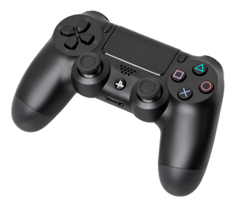
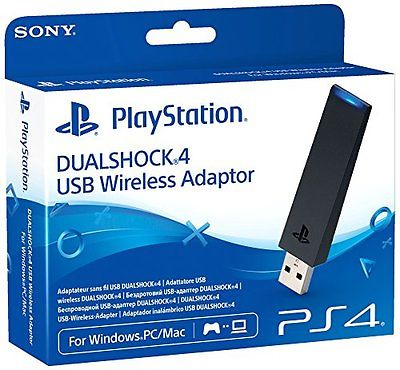

The Sony PlayStation 4 Dualshock 4 is a very well made controller. It feels solid and has an excellent D-Pad. It has wireless functionality and can charge its internal battery via Micro USB.

There are a few ways to use the Dualshock 4 with the Raspberry Pi:

* **USB Cable**  
    The simplest way is to plug in with a Micro USB cable. You could probably buy a very long (3M/10ft) USB cable if you wish to sit a bit back from the screen.

* **Sony USB Wireless Adapter**  
    All official PS4 controllers should be able to pair with the official Sony Dualshock 4 USB Wireless Adapter.

* **Mayflash Magic-NS Wireless Adapter & Mayflash Magic-S Wireless Adapter**  
    Both of these adapters by Mayflash are affordable and solid third-party wireless adapters that perform almost exactly the same as the official adapter with the added bonus of being able to use either for other types of controllers as well. However, their method of d-pad input does not work with PPSSPP for PSP emulation.

* **Bluetooth**  
    If you wish to use either a USB Bluetooth adapter or the Pi 3's built-in Bluetooth then regular Bluetooth pairing in the menu may work, or you may need to use the userspace controller driver called `ds4drv`. It depends on your individual controller.

## General Controller Usage

### Pairing Mode

To put the controller into pairing mode, press and hold the **Share** button then the **PS** button.

After a few seconds, the light bar will strobe rapidly and brightly.

The controller is now in pairing mode.

### To turn the controller off

The controller will not sleep on its own if left idle, it will remain on until the battery goes flat.

To force the controller to go to sleep, hold the **PS** button for 10 seconds.

Once the light bar turns off, the controller is asleep.

Shutting down your Pi will also turn the controller off.

### To wake up the controller

Tap the **PS** button.

The light bar will turn on. The controller will automatically re-connect to anything it's already been paired to.

### To charge the controller

Connect the controller to any USB host (Raspberry Pi, powered USB hub, television USB port) or any USB charger (phone/tablet charger, USB battery, official or aftermarket controller charging station).

The light bar will pulse yellow while charging, and turn off when fully charged.

The Dualshock 4 can charge off either a USB host or a USB charger. It does not need to be connected to a USB host like the Dualshock 3 did.

## Usage Methods

### USB Cable

Just plug the USB-A into the Raspberry Pi and the Micro USB into the controller. Done.

The light bar will glow dull blue when the controller is in use as a USB device this way.

If you are concerned about power usage, charging the Dualshock battery can use up to 500mA of power.

### Sony Dualshock USB Wireless Adapter

This add-on product made by Sony does the Bluetooth pairing in hardware. To the Raspberry Pi and RetroPie, the controller appears as a regular wired USB controller and no additional software setup is required.

One adapter can pair one controller, though multiple adapters can be plugged into the one Pi to allow use of multiple controllers.

To pair the controllers:

* Plug in the USB adapter, it will slowly blink, this is the "searching" signal
* Push the adapter in more, it moves slightly inwards, and hold for 3 seconds
* The USB adapter blinks faster, this is the "pairing" signal
* Put the controller into pairing mode with **Share** and **PS**
* The USB adapter light and controller light bar will go solid, they are now paired

Repeat with additional adapters and controllers as required.

### Regular Bluetooth Pairing

**Not all PS4 controllers can be used this way!!!**

Try yours and see how it goes. If it doesn't work, then proceed to the next heading about `ds4drv`.

* Enter the RetroPie Setup Script
* Configuration / Tools
* 802 - bluetooth (as of RetroPie v4.2, it is now listed as _**804 - bluetooth**_)
* Register and Connect to Bluetooth Device
* Put the controller into pairing mode with **Share** and **PS**
* Choose the first/top/default method of pairing in the menu

Once paired, see if EmulationStation will recognise the controller.

If EmulationStation does respond to button presses, lucky you, you're done.

If EmulationStation doesn't respond to button presses, then your controller cannot be used this way. Unpair it and use the `ds4drv` method.

The reason why all controllers don't work like this is not clear but controller firmware is suspected to be the reason - with "old" firmware able to be used as a regular Bluetooth controller and "new" firmware not able to be used this way - however it may also be some other non-obvious reason.

If firmware is the reason, it's likely that System Software 3.50 (April 6th 2016) is the changeover, although it may be an even earlier update.

### Userspace Controller Driver (ds4drv)

`ds4drv` is a userspace driver which allows the Dualshock 4 to be used when regular Bluetooth does not work.

The source code and further description is available at:

* https://github.com/chrippa/ds4drv

#### Which Bluetooth Adapter To Use

* **Pi 1 or Pi 2 or Pi Zero**: Use a USB Bluetooth adapter as these models do not have onboard Bluetooth
* **Pi 3 with RetroPie 3.7 and later**: Use the onboard Bluetooth
* **Pi 3 with RetroPie earlier than 3.7**: Disable the onboard Bluetooth and use a USB Bluetooth adapter. Onboard BT is disabled by adding `dtoverlay=pi3-disable-bt` to `/boot/config.txt`

#### Installation

Install the Python 3 requirements, and then install `ds4drv` with the Python package manager:

~~~
sudo apt update
sudo apt install python3-dev python3-pip
sudo pip3 install ds4drv
~~~

Allow non-root users to control the `ds4drv` joystick:

~~~
sudo wget https://raw.githubusercontent.com/chrippa/ds4drv/master/udev/50-ds4drv.rules -O /etc/udev/rules.d/50-ds4drv.rules
sudo udevadm control --reload-rules
sudo udevadm trigger
~~~

Test the controller to see if it can connect:

~~~
ds4drv --hidraw --led 000008
~~~

(Note: the `--led 000008` can be omitted or changed to modify the controller light bar color)

Put the controller into pairing mode with **Share** and **PS**. It should connect to `ds4drv` within a few seconds.

Once you have confirmed the controller connects, exit `ds4drv` with Ctrl+c, the controller will disconnect.

(Note: Some controllers will require ds4drv but not hidraw to run. If the above command does not work, try running just `ds4drv --led 000008` instead.)

Now configure `ds4drv` to run at startup by editing the `rc.local` file:

~~~
sudo nano /etc/rc.local
~~~
    
After the `# By default this script does nothing.` line, add a new line with the contents:

~~~
/usr/local/bin/ds4drv --hidraw --led 000008 &
~~~

(again, you can remove or change the `--led 000008` as desired)

(Note: If you had to drop the --hidraw to test the connection in the previous step, then do not include it in the rc.local file either. Just `/usr/local/bin/ds4drv --led 000008`)

The correct complete `rc.local` file will look like:

~~~
# By default this script does nothing.
/usr/local/bin/ds4drv --hidraw --led 000008 &
exit 0
~~~

Save this file and quit the text editor.

Turn the controller off by holding the **PS** button for 10 seconds until the light bar turns off.

Reboot the Pi:

~~~
sudo reboot
~~~

Once RetroPie reboots and is at the EmulationStation screen saying "No controllers are detected", put the controller into pairing mode with **Share** and **PS**. The controller should connect to the `ds4drv` running in the background.

If EmulationStation does not recognise the newly-paired controller, then press F4 to quit EmulationStation and run `emulationstation` to restart it, or just reboot your Pi and tap the **PS** button every few seconds to encourage the controller to re-connect to the `ds4drv` instance as soon as it runs.

Once EmulationStation recognises the controller, proceed with the usual EmulationStation input setup.